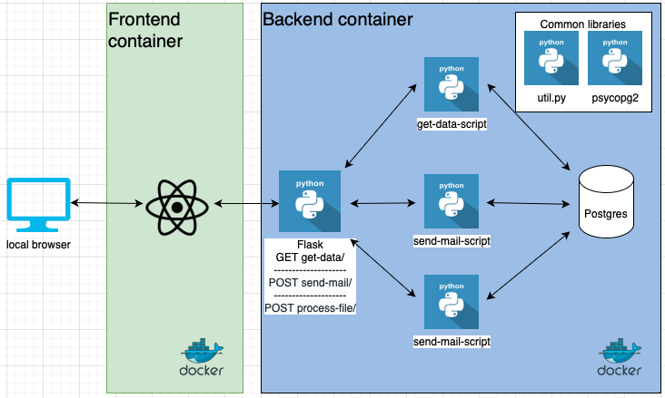
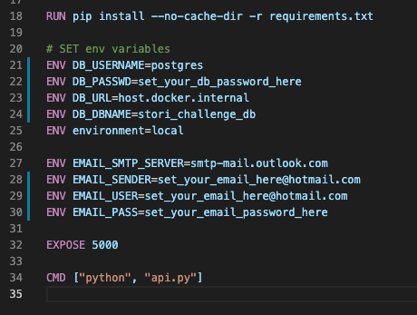
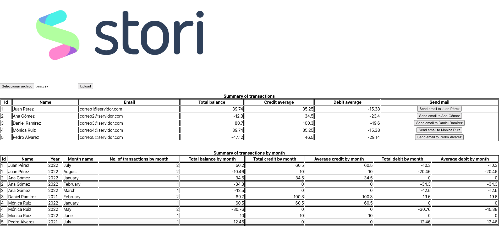

# stori_tech_challenge
Tech challenge for Stori Software Engineer/Tech Lead

Here´s the original specification for the challenge:
```
Thanks for your interest in joining Stori. At this stage, we ask you to solve the following challenge. Best of luck! 

For this challenge you must create a system that processes a file from a mounted directory. The file will contain a list of debit and credit transactions on an account. Your function should process the file and send summary information to a user in the form of an email. 

An example file is shown below; but create your own file for the challenge. Credit transactions are indicated with a plus sign like +60.5. Debit transactions are indicated by a minus sign like -20.46 

|Id   |Date    |Transaction|
|-----|--------|-----------|
|    0|7/15    |      +60.5|
|    1|7/28    |      -10.3|
|    2|8/2     |     -20.46|
|    3|8/13    |        +10|

(txns.csv)

We prefer that you code in Python or Golang; but other languages are ok too. Package your code in one or more Docker images. Include any build or run scripts, Dockerfiles or docker-compose files needed to build and execute your code. 

## Bonus points 
1. Save transaction and account info to a database 
2. Style the email and include Stori’s logo 
3. Package and run code on a cloud platform like AWS. Use AWS Lambda and S3 in lieu of Docker. 

## Delivery and code requirements 
Your project must meet these requirements: 

1. The summary email contains information on the total balance in the account, the number of transactions grouped by month, and the average credit and average debit amounts grouped by month. Using the transactions in the image above as an example, the summary info would be Total balance is 39.74 Average debit amount: -15.38 Number of transactions in July: 2 Average credit amount: 35.25 Number of transactions in August: 2 
2. Include the file you create in CSV format. 
3. Code is versioned in a git repository. The README.md file should describe the code interface and instructions on how to execute the code. 
```
# Proposal solution

## Data Base
I propose to use following Data-Model:

<p align="center">
  
</p>

# Data dictionary

## Client 
|column   |type    |description|
|---------|--------|-----------|
|id       |varchar |Unique ID for every client (e.g. 1)|
|name     |varchar |Full name of the client (e.g. Marco Monroy)|
|email    |varchar |Email address of the client. Will be used CC destination in Summary email (e.g. ronmoy007@hotmail.com)|

## Transaction 
|column    |type    |description|
|----------|--------|-----------|
|id        |varchar |Unique ID for every transaction (e.g. 2)|
|clinet_id |varchar |Foreign key into client table (e.g. 1|
|txn       |txn_date|Date of transaction. (e.g. 2022-12-24)|
|amout     |float   |Number that represent if its a credit or debit operation (based on the sign of the number. Positive means credit and negative means debit|
|batch_file|varchar |Name of the file processed containing transactions|


The proposal solution implies 5 changes to the original challenge:

1. Create an additional table to store clients.
2. The layout of input file needs to be changed to add the user id.
3. Id column for transaction will be removed from source file and it will be calculated on execution time.
4. The transaction date must include year.
5. Plus sign can be ommited for positive numbers

So the final layout input will look like:

|client_id   |Date    |Transaction|
|------------|---------|-----------|
|           1|7/15/2022|       60.5|
|           1|7/28/2022|      -10.3|
|           2|8/2/2022 |     -20.46|
|           2|8/13/2021|         10|

**Note:** Before process any transaction file, client's table must exists with data (a script to populate client table is provided)

## Overall architecture

Insted of just reading the transactions file from a directory or S3 bucket, a more frieldy solution was developed to allow upload the transaction file from a computer.

This solution was designed in such way that is easy to develop and test in local environment and then push the code into a github repo which is already configurated with a CI/CD mechanism to deploy the code into AWS cloud.

Architecture in AWS contains:
- RDS-Postgresql (*database*)
- Lambda function to read the data (*backend*)
- Lambda function to process the file with transactions (*backend*)
- Lambda function to send email with info of a client (*backend*)
- Api-gateway to handle http petitions and call corresponding lambda (*backend*)
- S3 bucket to store static React app with UI to upload transaction file and see summary online (*frontend*)
- CloudFront for distribution of the web content (*frontend*)

The following diagram ilustrates the cloud architecture:

<p align="center">
  
</p>

For local develop and testing the following architecture is used:
 - Local Postgres (*database*)
 - Python file with the logic for Lambda to read the data (*backend*)
 - Python file with the logic for Lambda to process the file (*backend*)
 - Python file with the logic for Lambda to send email (*backend*)
 - Flask API to simulate AWS-API-gateway
 - React app with UI to upload transaction file and see summary

All componentes of the backend run in a Docker contanier (backend-container)
The React app runs in a Docker container (frontend-container)

The following diagram ilustrates the local architecture:

<p align="center">
  
</p>
# Considerations aboutn email sending in local
This solutions uses SMTP protocol to send emails. Not all email providers allow to send emails programatically. To be able to test this functionality, it's a pre-requisite to have an outlook or hotmail acount. (For testing purposes, the sender and recipient will be the same person, and the client's email will be added as CC).

# Considerations aboutn email sending in AWS
Sending emails in AWS is not so straighforward, because by default AWS blocks email ports (25, 587, ...). A petition was sent to AWS to remove that restriction, so at the moment the email sending in aws is not available.

# Steps to test the solution locally

1. **Install Postgresql** (I used Homebrew for Mac: https://wiki.postgresql.org/wiki/Homebrew)

2. **Start postgresql** 

(If you are using mac-brew, the following command is available)

`brew services start postgresql`

3. **Create DB**

`PGPASSWORD=set_your_password_here psql -h localhost -U postgres -a -f 03_database/create_database.sql`

4. **Run scripts (build tables and populate client table)**

`PGPASSWORD=set_your_password_here psql -h localhost -U postgres -d stori_challenge_db -a -f 03_database/create_tables.sql`

`PGPASSWORD=set_your_password_here psql -h localhost -U postgres -d stori_challenge_db -a -f 03_database/load_users.sql`

5. **Install Docker** (I used MAC version: https://docs.docker.com/desktop/install/mac-install/)

6. **IMPORTANT**

If the solution is running on top of MAC-M1 chip the following command is required to change the docker default platform:

`export DOCKER_DEFAULT_PLATFORM=linux/amd64`

7. **Update credentials for DB and email**

There are env variables that must be updated to allow backend to connect into local DB and authenticate into SMTP server.

Open the file: 

`02_backend/Dockerfile`

And update lines from 21 to 24 with the credentials for local DB
and 28 to 30 with the credentials for local DB and the outlook to send emails.

<p align="center">
  
</p>

(Line 23 must be **"host.docker.internal"** for MAC, otherwise it could be **"localhost"**)

7. **Create Docker container (Backend-API)**

`docker build -f 02_backend/Dockerfile -t stori-api .`

8. **Run Docker container (Backend-API)**

`docker run -it --rm -p 8000:5000 stori-api:latest`

After running the previous command, the api will be running and waiting for http requests:

<p align="center">
  
</p>

(The terminal for backend must be active for testing)

9. **Open a new terminal (to build and run frontend UI)**

10. **Create Docker container (Frontend)**

`docker build -f 01_frontend/Dockerfile -t stori-frontend .`

11. **Run Docker container (Frontend)**

`docker run -it --rm -p 3000:3000 stori-frontend:latest`

After running the previous command, the react app will be running:

<p align="center">
  
</p>

(The terminal for frontend must be active for testing)

12. **Check UI**

Open an internet browser and enter into following url:

`http://localhost:3000`

<p align="center">
  
</p>

12. **Upload csv file with transactions**

 - Clic **"Choose File"** button
 - Pick "txns.csv" file 
 - Clic **""Upload""** button

 After loading the file, the tables will be updated by the app:

<p align="center">
  
</p>

(In this view the info for all clients is displayed)

13. **Send email**

  In the section **"Summary of transactions"** click **"Send mail"** on any client (the first client contains the same data provided in the challenge example). 

  A confirmation of the request will be shown in screen:

<p align="center">
  
</p>
  
  After a few seconds, an email will be delivered into the email account provided in Step 7. The client email is included in CC email section:

<p align="center">
  
</p>

  (Emails contains data only for a single client.)

14. **More tests**

Is possible to repeat Steps 12 and 13 to add more data and see how data change. It's also possible to edit the content of **"txns.csv"** file (however the app does not validate number of columns or datatypes of file, so avoid changes on the data structure of the file).

15. **Sopt containers**

Once validations are done, is possible to stop both Docker containers pressing in each terminal:

`Ctrl+C`

16. **Code changes**

After any modification in the code will be necesary to run again:
- Step 7 and 8 for changes in backend
- Step 9 and 10 for changes in frontend

# Steps to test the solution in AWS cloud

1. **Open url in broser**

`https://d22r1r8etu5oih.cloudfront.net/`

<p align="center">
  
</p>

The app is already ready to:
- Pick files
- Upload files
- See data updated in UI
- The app also has the code to send emails, but as it was mentioned above: a petition was sent to AWS to remove restrictions on port 25 and 587. Until recieveng the permission, this functionality is not available on the cloud. However the same code for local host must be functional for the aws-lambda (as the rest of the lambdas)

# CI/CD

This architecture not only was designed to offer a friendly UI, but to be able to set up a CI/CD mechanism in an easy way.

For every push into main branch, github actions:
 - Zips the code for every lambda 
 - Uploads the zip file into aws to update aws lambdas (*backend*)
 - Generates a build for react app 
 - Uploads the build into S3 bucket (*frontend*)
 - Refreshes CloudFront (*frontend*)

Since the solution is a monorepo, even if there's a change only in the code of a lambda function, all solution is deployded into production. The design of the solution and repo is made in such way that it would be easy to split frontend and backend (or even split lambdas) into different repos.
