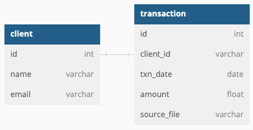

# stori_challenge
Challenge for Stori Software Engineer/Tech Lead

Here´s the original specification for the challenge:

Thanks for your interest in joining Stori. At this stage, we ask you to solve the following challenge. Best of luck! 

For this challenge you must create a system that processes a file from a mounted directory. The file will contain a list of debit and credit transactions on an account. Your function should process the file and send summary information to a user in the form of an email. 

An example file is shown below; but create your own file for the challenge. Credit transactions are indicated with a plus sign like +60.5. Debit transactions are indicated by a minus sign like -20.46 

|Id   |Date    |Transaction|
|-----|--------|-----------|
|    0|7/15    |      +60.5|
|    1|7/28    |      -10.3|
|    2|8/2     |     -20.46|
|    3|8/13    |        +10|

(txns.csv)

We prefer that you code in Python or Golang; but other languages are ok too. Package your code in one or more Docker images. Include any build or run scripts, Dockerfiles or docker-compose files needed to build and execute your code. 

## Bonus points 
1. Save transaction and account info to a database 
2. Style the email and include Stori’s logo 
3. Package and run code on a cloud platform like AWS. Use AWS Lambda and S3 in lieu of Docker. 

## Delivery and code requirements 
Your project must meet these requirements: 

1. The summary email contains information on the total balance in the account, the number of transactions grouped by month, and the average credit and average debit amounts grouped by month. Using the transactions in the image above as an example, the summary info would be Total balance is 39.74 Average debit amount: -15.38 Number of transactions in July: 2 Average credit amount: 35.25 Number of transactions in August: 2 
2. Include the file you create in CSV format. 
3. Code is versioned in a git repository. The README.md file should describe the code interface and instructions on how to execute the code. 

# Proposal solution

## Data Base
I propose to use following Data-Model:

  

# Data dictionary

## Client 
|column   |type    |description|
|---------|--------|-----------|
|id       |varchar |Unique ID for every client (e.g. xxxx-xxxx-xxxx)|
|name     |varchar |Full name of the client (e.g. Marco Monroy)|
|email    |varchar |Email address of the client. Will be used as destination Summary email (e.g. ronmoy007@hotmail.com)|

## Transaction 
|column    |type    |description|
|----------|--------|-----------|
|id        |varchar |Unique ID for every transaction (e.g. xxxx-xxxx-xxxx)|
|clinet_id |varchar |Foreign key into client table|
|txn       |txn_date|Date of transaction. (e.g. 2022-12-24)|
|amout     |float   |Number that represent if its a credit or debit operation (based on the sign of the number. Positive means credit and negative means debit|
|batch_file|varchar |Name of the file processed containing transactions|

The proposal solution implies 5 changes to the original challenge:

1. Create an additional table to store clients
2. The layout of input file needs to be changed to add the user id.
3. Id column for transaction will be removed from source file and it will be calculated on execution time.
4. The transaction date must include year. (Input file format is: MM/dd/yyyy, but database is yyyy-MM-dd)

So the final layout input will look like:

|client_id   |Date    |Transaction|
|------------|---------|-----------|
|           1|7/15/2022|      +60.5|
|           1|7/28/2022|      -10.3|
|           2|8/2/2022 |     -20.46|
|           2|8/13/2021|        +10|

**Note:** Before process any transaction file, client's table must exist (A mechanism to add clients will be needed)

## Overall architecture

  

In this delierable all services are stored in one single repo, but they can be easily splited into 4 different repos (micro-services):
* 1 repository for frontend
* 3 repositoies for backend (one by lambda)
* 1 repo for db model

# Run solution locally

0. **Create conda environment and activate it**

1. **Install Postgresql** (I used Homebrew for Mac: https://wiki.postgresql.org/wiki/Homebrew)

2. **Start postgresql** 

`brew services start postgresql`

3. **Create DB**

`createdb -h localhost -p 5432 -U postgres stori_challenge_db`

4. **Run scripts (build tables and populate client table)**

`psql -h localhost -U postgres -d stori_challenge_db -a -f 03_database/create_tables.sql`

`psql -h localhost -U postgres -d stori_challenge_db -a -f 03_database/load_users.sql`

5. **Install Docker** (I used MAC version: https://docs.aws.amazon.com/serverless-application-model/latest/developerguide/install-sam-cli.html)

6. **Optional**

If the solution is running on top of MAC-M1 chip the following command is required to change the docker default platform:

`export DOCKER_DEFAULT_PLATFORM=linux/amd64`

7. **Create Docker container (Backend-API)** (I used MAC version: https://docs.docker.com/desktop/install/mac-install/)

`docker build -f 02_backend/Dockerfile -t stori-api .`

8. **Run Docker container (Backend-API)**

`docker run -it --rm -p 8000:5000 stori-api:latest`

9. **Create Docker container (Frontend)**

`docker build -f 01_frontend/Dockerfile -t stori-frontend .`

10. **Run Docker container (Frontend)**

`docker run -it --rm -p 3000:3000 stori-frontend:latest`
